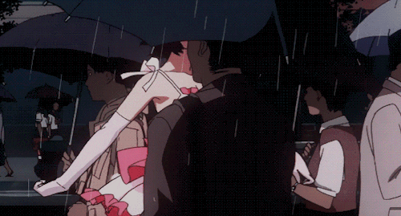

 

## 

 <h2 align="center"> <em>「 ✦ About me ✦ 」</em></h2>

 

  Hello There! <em><b> I'm Letícia de Moraes </b></em>, a Systems Analysis and Development student. During high school, I completed a technical program in Information Technology integrated with high school. I enjoy programming, especially in Java. Currently, I’m improving my programming skills and expanding my knowledge in technology.

 
 

   <em>𓍢ִ໋. ✿ <b>  Studying at Instituto Federal de Pernambuco - Campus Garanhuns (IFPE) </b></em>  
   <em>𓍢ִ໋. ✿ <b>  I'm 19 years old and I'm from Garanhuns - Pernambuco, in Brazil. </b></em>  

 

  <h2 align="center"> <em>「 ✦ Technologies ✦ 」</em></h2>

  
  
  
  
  
  
  
  
  
  

 
 <h2 align="center"> <em>「 ✦ Statistics ✦ 」</em></h2>

<picture>
  <source media="(prefers-color-scheme: dark)" srcset="https://raw.githubusercontent.com/leticiamoraess/leticiamoraess/output/github-contribution-grid-snake-dark.svg">
  <source media="(prefers-color-scheme: light)" srcset="https://raw.githubusercontent.com/leticiamoraess/leticiamoraess/output/github-contribution-grid-snake.svg">
  
</picture>
